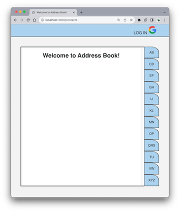
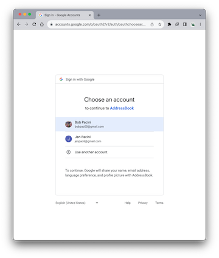
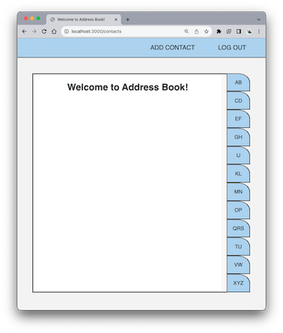
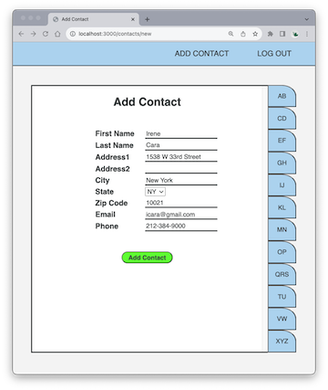
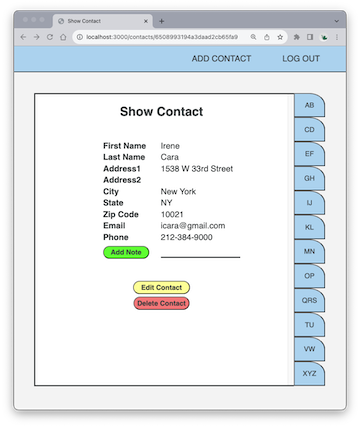
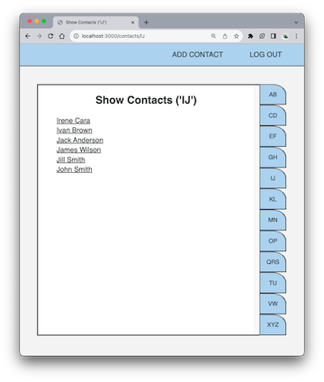

# Address Book
Address Book is an app to store all your contact information. 

## Getting Started
Click [here](https://addressbook-udqv.onrender.com/contacts) to start up Address Book.

## Start up
When the app is first started up, it requires you to login using your google login. Click on "LOG IN" in the upper right-hand corner of the page.

## Logging in
You'll now see the Google Account Page. Choose the account you want to use.

Once logged in, you'll see the Address Book welcome page.

## Add Contact
You're now ready to create your first user! To do this, select "Add Contact" at the top of the page. Fill in the contact information, as shown below. When finished, select the green "Add Contact" button.

## Show, Edit, Delete Contact
After the contact has been created, the "Show Contact" page appears giving you the opportunity to add notes (e.g. birthday). You'll also have the option of editting or deleting the contact.

## Show Contacts
If you wish to see all the contacts that have a first name beginning with a letter, click on a tab on the right hand side. For example, if you wish to see all contacts that have a first name beginning with either "I" or "J", click on the "IJ" tab.

Click on a contact to show, edit, or delete it.

## Technologies Used
- HTML
- CSS
- Mongoose
- Express
- Node

## Trello board (Planning)
Click [here](https://trello.com/b/vLkt1Klk/addressbook)